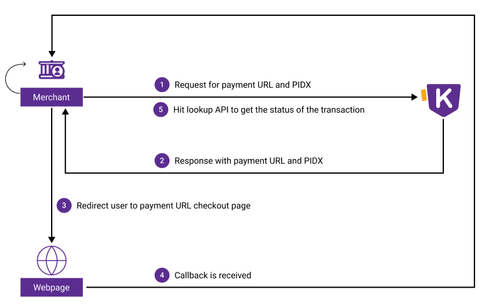
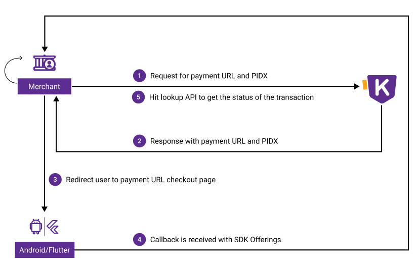

This document serves as a comprehensive guide to integrating the Khalti Payment Gateway (KPG) into your system. The integration process involves signing up as a merchant, understanding the integration methods for web and mobile, and transitioning to a live environment after successful testing.

- [1. Signup as a Merchant in Khalti](#1-signup-as-a-merchant-in-khalti)
- [2. ePayment Gateway Integration](#2-epayment-gateway-integration)  
	- [2.1. Web](#21-web-checkout) 
	- [2.2. Mobile](#22-mobile-checkout)  
- [3. Test Environment](#3-test-environment) 
- [4. Going Live](#4-go-live)

## 1. Signup as a Merchant in Khalti

Before proceeding with the integration, it's essential to understand the terms used throughout the documentation: 

+ **Merchant :** Online business services such as e-commerce websites, ISP online payment portals, or online movie ticket platforms seeking to receive online payments via KPG. 

If you're new to Khalti Payment Gateway service, familiarize yourself with its offerings by reading [here](./index.md)  for a better understanding.

To initiate the integration process, sign up  as a merchant account :

- [Create a merchant account](https://khalti.com/join/merchant/)

## 2. ePayment Gateway Integration 
The integration process varies depending on whether you're integrating KPG on a web or mobile platform. Follow the steps outlined below accordingly:

### 2.1. Web Checkout 
 
The payment process flow of KPG Web Checkout is as follows: 

1. Merchant requests Khalti  to initiate the online payment. 
2. Khalti system returns with `pidx` and `payment_url`.
3. The user must be redirected to `payment_url`.
4. After payment, callback is received from Khalti system.
5. Merchant side must hit the lookup API to get the status of the transaction.

If you are looking to integrate KPG on web application, then the integration must be done by integrating the web checkout. Please follow the documentation here to proceed [Web Checkout](./khalti-epayment.md).
 
Checkout provides all the necessary Uls and perform necessary processes to initiate and confirm the payment.

### 2.2. Mobile Checkout
 

The payment process flow of KPG SDK (Android & Flutter) is as follows: 

1. Merchant requests Khalti  to initiate the online payment. 
2. Khalti system returns with `pidx` and `payment_url`.
3. The merchant system must pass `pidx`, `keys` and `return URL` in client side SDK (Android and Flutter) for initiating the online payment.
4. After payment, the return message is obtained on the client side along with extra SDK offerings.

5. Merchant side must hit the lookup API to get the status of the transaction.
!!! info "Note" 
    The return url  must be same while generating PIDX and in SDK To get callback or SDK offering 

If you are looking to integrate KPG in mobile, then the integration must be done by integrating the provided SDKs. Please follow the documentation here to proceed: 

- [Android SDK](./checkout/android.md) 
- [Flutter SDK](./checkout/flutter/khalti-checkout.md)

Checkout provides all the necessary Uls and perform necessary processes to initiate and confirm the payment.

## 3. Test Environment

 

!!! info "Access Information"

    > **For Sandbox Access**

    > Signup from 
        [here](https://test-admin.khalti.com/#/join/merchant) as a merchant. 

    > **URL :** https://dev.khalti.com/   
    > **Server Side Authorization Key :**  Live secret key 
    > **Client Side Authorization Key (Android / Flutter SDK):** Live public key
    
!!! info "Test Credentials for sandbox environment"

    > **Test Khalti ID for**
    9800000000
    9800000001
    9800000002
    9800000003
    9800000004
    9800000005
    
    > **Test MPIN**
    1111
    
    > **Test OTP**
    987654

!!! Important Note 
	Payment via E-Banking and Debit/Credit card is not supported in the test environment. However, after successful integration with KPG, this functionality will be enabled.
## 4. Going Live
After a successful integration test, a live merchant account must be created from here. The merchant must replace the Sandbox URL and authorization key with productions. Live keys will be generated in the merchant dashboard.
!!! info "Access Information"

    > **For Production**

    > Signup from 
        [here](https://admin.khalti.com/) as a merchant. 
        
    > **URL :** https://khalti.com/   
    > **Server Side Authorization Key :**  Live secret key 
    > **Client Side Authorization Key (Android / Flutter SDK):** Live public key   

!!! Important note
	Even after successful integration, you won't be able to receive payments above NPR 200 per transaction. Fill the KYC form and contact us at 9801890085 / 9801856440 / 9801165558 / 9801165557 to remove the limits and accept payments without restrictions.